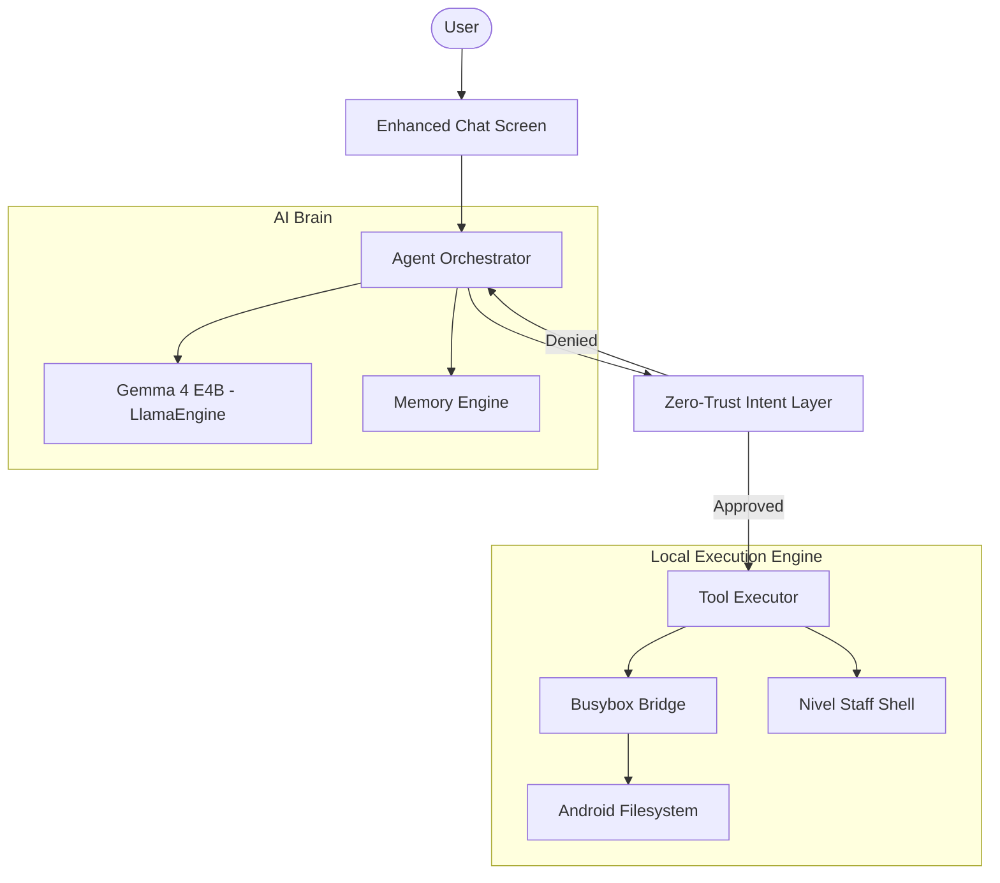

# 🌌 Elysium Code — The Ultimate Agentic AI Terminal


**Elysium Code** is a world-class, local-first agentic coding environment built for Android. It transforms a standard mobile device into a professional development powerhouse by integrating high-performance local LLMs (Gemma 4 E4B) with a real Linux-like execution runtime.

---

## 🚀 Key Features

- **Agentic ReAct Loop**: Autonomous task execution. The agent reasons, acts via tools, observes results, and iterates.
- **Nivel Staff Shell**: A custom-engineered bridge using **Busybox** and **PRoot**, providing a full Linux suite (`apt`, `grep`, `sed`, `gcc`) on Android.
- **Zero-Trust Security Layer**: Every destructive operation (filesystem writes, shell execution) requires explicit user intent validation via a premium UI layer.
- **On-Device Inference**: Powered by a custom `llama.cpp` JNI bridge, ensuring 100% privacy and zero latency from external APIs.
- **Multimodal Context**: Support for image and audio input (Work in Progress) within the agentic loop.

---

## 🏗️ Architecture Overview



---

## 🛠️ Technology Stack

| Component | Technology |
| :--- | :--- |
| **Language** | Kotlin, C++ (JNI) |
| **AI Model** | Gemma 4 E4B (GGUF Optimized) |
| **UI Framework** | Jetpack Compose (Neon Glassmorphic Design) |
| **Shell Runtime** | Busybox + PRoot |
| **Networking** | Ktor |
| **Build System** | Gradle + CMake |

---

## 📦 Installation & Setup

### 1. Requirements
- Android 12+ (SDK 31+)
- aarch64 device with minimum 6GB RAM (8GB+ recommended)
- 10GB free storage

### 2. Provisioning AI Weights
Elysium requires the Gemma 4 GGUF weights. Run the provided setup script:
```bash
chmod +x setup_model.sh
./setup_model.sh
```

### 3. Build & Deploy
Open the project in Android Studio and run `./gradlew assembleDebug`.

---

## 🛡️ Security Model: Zero-Trust Intent
Unlike standard "agentic" apps that execute commands blindly, Elysium implements a **Blocking Intent Layer**. When the agent identifies a destructive tool (e.g., `execute_command`, `delete_file`), the engine pauses execution and presents a high-fidelity **Intent Validation Card**. The agent cannot proceed without a cryptographically-driven approval signal from the user.

---

## 📜 License
Professional Edition. All rights reserved. 2026.
Designed with ❤️ for the next generation of mobile developers.
